# Victor Dias

**Aprendendo DevOps e SRE com foco em infraestrutura cloud, automação, Kubernetes e confiabilidade.**

 
 

## Sobre

Estou desenvolvendo experiência prática em DevOps e SRE criando projetos pequenos e repetíveis sobre infraestrutura, automação, Kubernetes, fluxos de deploy e confiabilidade operacional.

Meu objetivo atual é transformar aprendizado prático em repositórios públicos úteis para consulta, fáceis de executar e claros para outras pessoas entenderem.

## Foco Atual

| Área | O que estou praticando |
| --- | --- |
| Cloud e IaC | Fundamentos de AWS, Terraform e ambientes reproduzíveis |
| Containers e Kubernetes | Docker, Kubernetes, serviços locais e configuração de runtime |
| Entrega | Git, GitHub Actions, CI/CD e práticas de release |
| Operações | Linux, Bash, troubleshooting, logs, métricas e alertas |
| Confiabilidade | Documentação, aprendizado com incidentes e melhorias mensuráveis |

## Tecnologias

## Projetos em Destaque

| Repositório | Foco |
| --- | --- |
| [terraform-aws-static-site](https://github.com/victor-dias21/terraform-aws-static-site) | Laboratório Terraform para site estático na AWS com S3, CloudFront, Route 53 e ACM |
| [kubernetes-troubleshooting-lab](https://github.com/victor-dias21/kubernetes-troubleshooting-lab) | Cenários práticos de troubleshooting Kubernetes para DevOps e SRE |
| [github-actions-devops-pipeline](https://github.com/victor-dias21/github-actions-devops-pipeline) | Pipeline CI/CD com GitHub Actions, FastAPI, testes, lint e Docker |
| [terraform-aws-s3-website-test](https://github.com/victor-dias21/terraform-aws-s3-website-test) | Primeiro estudo de Terraform para infraestrutura de site estático na AWS |
| [imersao-devops-alura](https://github.com/victor-dias21/imersao-devops-alura) | Projeto de aprendizado DevOps com Python e fundamentos de deploy |
| [cs2-docker-server](https://github.com/victor-dias21/cs2-docker-server) | Servidor dedicado empacotado com Docker |

## Como Trabalho

- Construir pequeno e tornar repetível.
- Preferir automação em vez de correções manuais.
- Documentar comandos, premissas e tradeoffs.
- Manter o aprendizado visível em repositórios práticos.
- Tratar confiabilidade como um ciclo: observar, medir, melhorar e compartilhar.

## Visão Geral do GitHub

 
 

 

## Contato

- GitHub: [victor-dias21](https://github.com/victor-dias21)
- LinkedIn: [victor-rebelo-dias](https://www.linkedin.com/in/victor-rebelo-dias/)
- Organização: Cogna Educação
- Localização: São Paulo, Brasil
